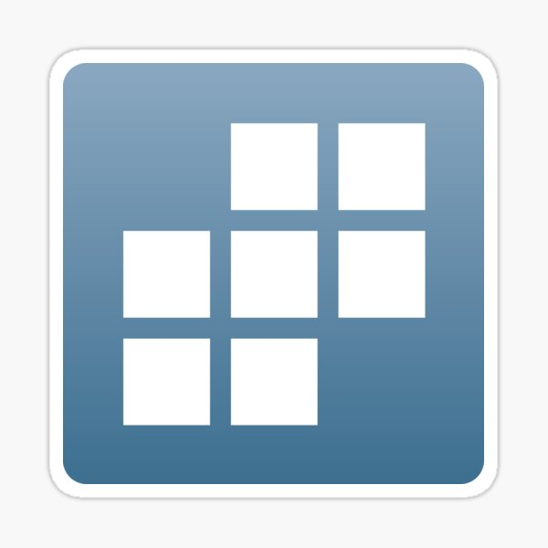

# Hello, I'm Ryan Oesterle! 👋
I'm a student at the **University of Notre Dame** studying Economics.

**About Me**
- 🎓 Currently taking Introduction to Data Science (Learning Python, pandas, and data visualization)
- 🌍Previously Studied abroad in Oman
- 📚 Pursuing Law School in the future
- ⚽ I enjoy running and competing in team sports

### Technical Skills
**Languages & Tools**
- Python
- Stata
- GitHub

## Most Recent Projects
- [My Data Science Portfolio](https://github.com/21ryano/Oesterle-Data-Science-Portfolio)

## 🎯 Goals
- Develop Python profiency 
- Improve visualization techniques  
- Create real-world projects

 📫 You can reach me at:**roester2@nd.edu**
